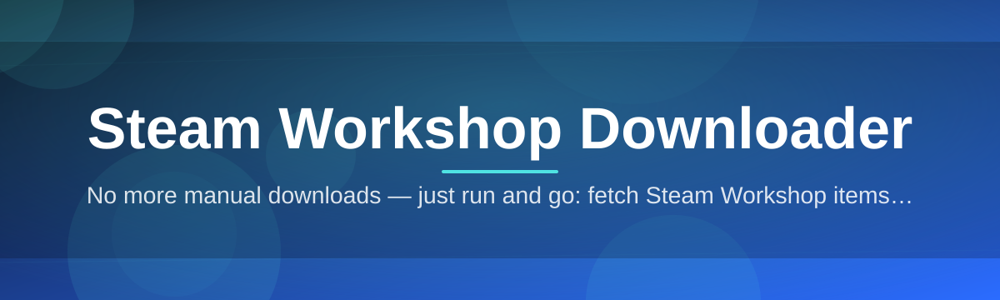
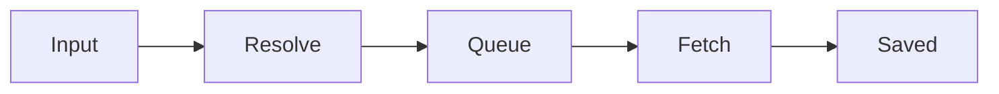

# steam-workshop-manager 🎮📦

  

*Grab any Steam Workshop item, in bulk or one at a time, without ever opening Steam itself.*

  

## 🧭 Overview

Steam Workshop hosts millions of mods, maps, skins, and collections — but pulling them down reliably, especially in batches, has always meant fighting the client, subscribing/unsubscribing just to force a sync, or hunting for the right item ID buried in a URL. **steam-workshop-manager** exists to remove that friction entirely. It's a focused Windows desktop tool built for one job: turning a Workshop link, an item ID, or a whole collection into files on your disk, quickly and predictably.

This project was born out of a simple frustration shared by server admins, mod pack curators, and content archivists — the Steam client is great for casual browsing, but terrible for repeatable, scriptable, or bulk retrieval. Whether you're maintaining a dedicated game server that needs the exact same mod set every deployment, archiving a collection before it disappears, or just tired of babysitting subscription queues, this tool gives you a direct, transparent path from Workshop page to local folder.

We built this for **server operators**, **mod pack maintainers**, **content archivists**, and **everyday players** who'd rather double-click an .exe than memorize command-line flags. No accounts to configure beyond what Steam already requires, no background services, no bloat — just a clean interface that does exactly what it says.

## 🚀 Ready to Grab It?

---

## 🔥 What Makes It Tick

- **Batch retrieval that actually scales** — feed it a whole collection URL and it queues every item inside, resolving nested dependencies without manual clicking.

- **Direct ID and URL parsing** — paste a raw Workshop link, a numeric item ID, or a collection page; the tool figures out what you meant and gets moving.

- **Resumable queues** — if a download stalls or your connection hiccups, the queue picks up where it left off instead of starting the whole batch over.

- **Per-item destination control** — route different mods to different folders (great for multi-game setups or organizing by mod type) instead of one giant dump folder.

- **Live progress telemetry** — per-file speed, ETA, and size estimates rendered in real time, so you're never staring at a frozen progress bar wondering if it's alive.

- **Metadata preview before you commit** — see title, file size, and last-updated date before a download starts, so you're not surprised by a 40GB texture pack.

- **History and re-download tracking** — a local log of everything you've pulled, with one click to re-fetch an updated version later.

- **Zero Steam client dependency** — runs independently, so you can keep the Steam client closed while it works in the background.

> [!TIP]
> Pasting a collection URL is almost always faster than adding items one by one — the parser expands the whole set automatically and deduplicates overlapping mods.

---

## 🧗 How to Get Started

1. **Visit the landing page** using the download button above — that's the only official source for the tool.

2. **Download the Windows build.** It ships as a single self-contained package; no installer wizard, no bundled toolchain.

3. **Run the executable.** Windows SmartScreen may flag it as unrecognized on first launch — that's normal for smaller independent projects; click through and it'll remember your choice.

4. **Paste a Workshop URL or ID, pick a destination folder, and hit download.** That's the entire workflow.

> [!NOTE]
> No sign-in, no external accounts, and no persistent background service are required to use the core downloader.

---

## 🖥️ System Requirements

| Requirement | Details |
|---|---|
| **OS** | Windows 10 (64-bit) or Windows 11 |
| **Dependencies** | None — fully standalone, no runtime installs needed |
| **Disk Space** | Varies by Workshop content; the app itself is lightweight |
| **Network** | Standard internet connection; faster connections shorten large batch pulls |
| **Permissions** | Standard user account; no admin rights required for normal use |

  

---

## ⚙️ How It Works

The pipeline behind steam-workshop-manager is intentionally simple, so it stays predictable even under heavy batch loads:

1. You provide a **Workshop URL, item ID, or collection link**.

2. The app **resolves metadata** — title, size, dependencies, last update timestamp.

3. Items are placed into a **download queue**, sequenced to respect bandwidth and avoid throttling.

4. Files are **fetched and written** to your chosen destination folder, verified for completeness.

5. A **local history entry** is recorded so you can track or re-fetch later.

> [!IMPORTANT]
> Large collections can contain hundreds of nested items. Give the resolver a moment to expand everything before assuming the queue is stuck.

---

## 🧩 Troubleshooting

<strong>The download stalls partway through — is it broken?</strong>

Not necessarily. Large Workshop files can pause briefly during server-side handoffs. Give it 30-60 seconds; if it truly stalls, the resumable queue will pick up from the last checkpoint rather than restarting.

<strong>Windows says the app is from an unrecognized publisher.</strong>

This is expected for independently distributed tools without a paid code-signing certificate. Click "More info" then "Run anyway" on the SmartScreen prompt.

<strong>A collection downloaded fewer items than expected.</strong>

Some Workshop items get removed or made private by their authors over time. The tool skips unavailable entries and logs them so you know exactly what was excluded.

<strong>Can I redirect where files are saved per game?</strong>

Yes — the destination folder setting can be changed per download session, so different mod sets can land in different directories.

<strong>Does this require the Steam client to be running?</strong>

No. The tool operates independently and does not require an active Steam client session for core downloads.

> [!WARNING]
> Respect mod authors' rights and Steam Workshop's terms of service. This tool is meant for personal backups, server provisioning, and archiving content you already have legitimate access to.

---

## 🎨 UI / UX Details

**Themes:** Light and Dark modes, switchable instantly from the settings panel — no restart required.

**Keyboard shortcuts:**

| Shortcut | Action |
|---|---|
| `Ctrl + V` | Paste Workshop URL/ID into the active input field |
| `Ctrl + Enter` | Start the current queue |
| `Ctrl + P` | Pause/resume active downloads |
| `Ctrl + L` | Open download history log |
| `Ctrl + ,` | Open settings |

**Settings persistence:** destination folder, theme, and bandwidth preferences are remembered between sessions automatically.

> [!TIP]
> Pin a default destination folder in settings so every new download session starts pre-configured for your usual workflow.

---

## 🤝 Contributing & Community

We welcome issues, feature requests, and pull requests from anyone who wants to sharpen this tool further.

- Open an issue for bugs or feature ideas — clear repro steps help enormously.

- Fork the repository, make your changes, and submit a pull request against the main branch.

- Keep contributions focused; smaller, well-scoped PRs merge faster than sprawling ones.

> Community-driven improvements are what keep this project stable release after release — thank you to everyone who files a report, tests a build, or opens a PR.

---

## 📜 License

Released under the [MIT License](LICENSE), 2026. Use it, fork it, build on it — just keep the license notice intact.

---

## ⚠️ Disclaimer

steam-workshop-manager is an independent, community-built utility and is not affiliated with, endorsed by, or sponsored by Valve Corporation or Steam. Users are responsible for complying with Steam's terms of service and respecting content creators' rights when downloading Workshop items.

